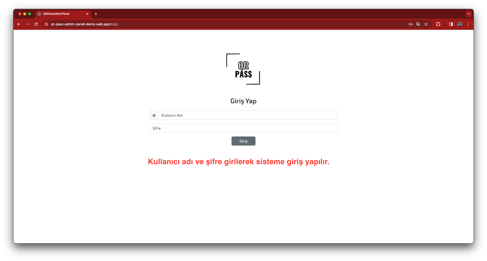

## PROJE TESLİMAT RAPORU

**Proje Bilgileri:**
- **Proje Adı:** QR Pass
- **Başlangıç Tarihi:** 13 Kasım 2023
- **Bitiş Tarihi:** 25 Aralık 2023
- **Proje Ekibi:**
  - Ahmet Faruk Çuha
  - İrem Tapsız
  - Semih Çay
  - Mustafa Umut İdam
  - İsa Uçar
  - Elif İrem Keskin
  - Batuhan Erol
  - Sümeyye Korkmaz

Bu rapor, QR Pass projesinin her aşamasının detaylı incelenmesi ve başarıyla tamamlanarak müşteriye teslim edilmesini onaylar. Proje sürecinde karşılaşılan zorluklar, çözüm yolları ve elde edilen sonuçlar aşağıda ayrıntılı olarak ele alınmıştır.

---

**Proje Aşamaları:**

1. **Planlama:**
   - Proje hedefleri, beklentiler ve kapsam netleştirildi.
   - Kaynak tahsisi, bütçe planlaması ve zaman çizelgesi hazırlandı.
   - Risk analizi yapılarak olası sorunlar için önlemler alındı.

2. **Analiz ve Tasarım:**
   - Kullanıcı ve sistem gereksinimleri detaylı bir şekilde incelendi.
   - Sistem mimarisi, teknolojik altyapı ve kullanılacak araçlar belirlendi.
   - Kullanıcı deneyimi (UX) tasarımı için ilk taslaklar oluşturuldu.

3. **Geliştirme:**
   - QR kod okuma ve doğrulama modülleri geliştirilerek entegre edildi.
   - Kullanıcı arayüzü ve kullanıcı deneyimi (UI/UX) tasarımları uygulandı.
   - Veritabanı tasarımı ve entegrasyonu tamamlandı.

4. **Test:**
   - Sistemin tüm modüllerinde kapsamlı fonksiyonel testler yapıldı.
   - Kullanıcı kabul testleri (UAT) ile gerçek kullanıcı deneyimleri incelendi.
   - Performans, güvenlik ve yük testleri başarıyla tamamlandı.

5. **Uygulama ve Dağıtım:**
   - Sistem, pilot grupla test edilerek gerçek kullanım koşullarında değerlendirildi.
   - Geri bildirimler ışığında son iyileştirmeler yapıldı.
   - Sistem kullanıma hazır hale getirildi ve dağıtım süreci başlatıldı.

---

**Proje Sonuçları:**
- QR Pass, belirlenen hedeflere uygun olarak ve zaman çizelgesine sadık kalarak başarıyla tamamlandı.
- Kullanıcı deneyimi, sistem performansı ve güvenlik açısından yüksek standartlarda geri bildirimler alındı.
- Proje, müşterinin ihtiyaçlarını karşılayan yenilikçi ve verimli bir geçiş kontrol sistemi olarak değer kazandı.

---

**Öneriler ve İyileştirmeler:**
- Sürekli gelişim çerçevesinde, gelecekteki sürümler için kullanıcı geri bildirimleri esas alınarak iyileştirmeler yapılması.
- Güvenlik ve veri koruma politikalarının düzenli olarak gözden geçirilmesi.
- Sistem entegrasyonu ve kullanıcı deneyimi konularında sürekli iyileştirme ve yeniliklerin uygulanması.

---

## Kullanma Kılavuzu
### Backend QRPass Service

## Müşteriye Projenin Teslim Şekli

### Backend QRPass Service
- QRPass web servisi ve postgres veritabanı, yüksek erişilebilirlik ve güvenilirlik sunan Heroku platformu üzerinde çalışmaktadır. Müşterimizin mail adresi Heroku'ya "collaborator" olarak eklenmiştir. Böylece tam erişim sağlanmış ve sistem yönetimi müşteriye devredilmiştir. Kaynak kodlar ve detaylı dokümantasyon müşteriye elektronik ortamda teslim edilmiştir.

### Frontend Admin Panel - Event Registration Panel
- Projenin frontend bileşenleri, kullanıcı dostu ve interaktif bir arayüz sunan Firebase üzerinde barındırılmaktadır. Müşterimizin mail adresi Firebase'e "owner" olarak eklenmiş, böylece tam kontrol sağlanmıştır. Kaynak kodlar ve kullanım kılavuzları müşteriye sağlanmıştır.

### Mobile QR Scanner
- Mobil uygulama, hem Android hem de iOS platformlarında sorunsuz çalışacak şekilde optimize edilmiştir. Uygulamanın uygulama mağazalarına yüklenmesi müşterinin tercihine bırakılmıştır. Kaynak kodlar, kurulum ve yayınlama rehberleri müşteriye teslim edilmiştir.

Bu projenin teslimi, müşterinin ihtiyaçlarını karşılamak ve uzun vadeli memnuniyetini sağlamak amacıyla titizlikle gerçekleştirilmiştir. Projemizin, müşterimizin iş süreçlerine değer katmasını ve başarılı bir işbirliğinin temelini atmasını umuyoruz.

